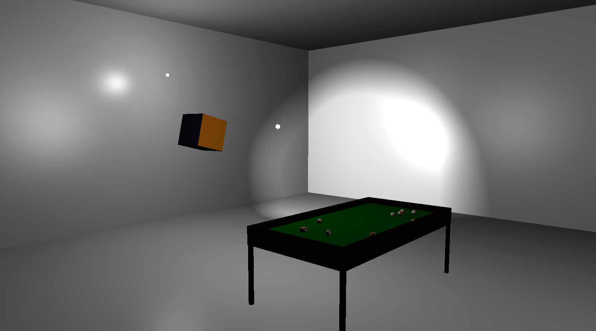
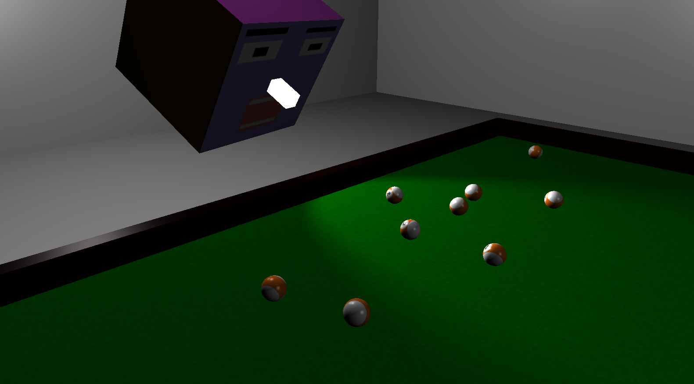
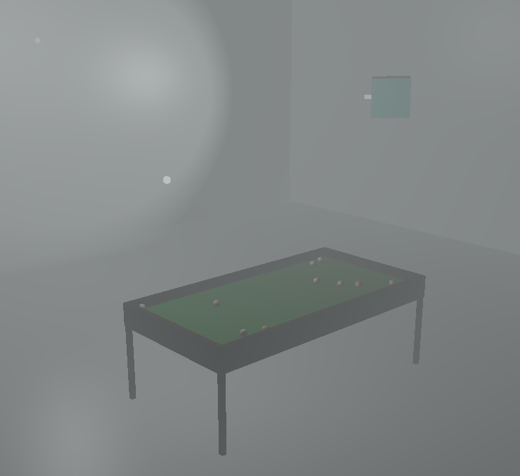

# 8 pool

## Description
8 pool is yet another project for a third year university subject Computer Graphics written in C++. I used GLFW (OpenGL) to render simple 3D scene. The scene includes a room with multiple light sources, a pool table with rolling billiard balls and an user-controlled flying head.

## Lighting
I have implemented a couple of shading algorithms:
* Phong-Blinn shading algorithm
* Phong shading algorithm
* Gouraud shading algorithm
* Flat shading algorithm

##  Controls
 * W, A, S, D, Mouse - moving around
 * Tab - change the camera
 * Space - toggle the flashlight (only when you are controlling the flying head)
 * Mouse scroll - change intensity of fog in the scene
 * F - toggle movement of the balls
 * 1 - change the lighting model to Phong-Blinn lighting model (default)
 * 2 - change the lighting model to Phong lighting model
 * 3 - change the lighting model to Gouraud lighting model
 * 4 - change the lighting model to flat lighting model
 * 5 - turn off shading (original texture colors)
 * 7, 8, 9 - toggle the light sources
 
## Used libraries
 * GLFW (OpenGL) - https://github.com/glfw/glfw
 * GLAD (GL loader) - https://github.com/Dav1dde/glad.git
 * GLM (matrix calculations) - https://github.com/g-truc/glm.git
 * STB (texture loading) - https://github.com/nothings/stb

## Screenshots

